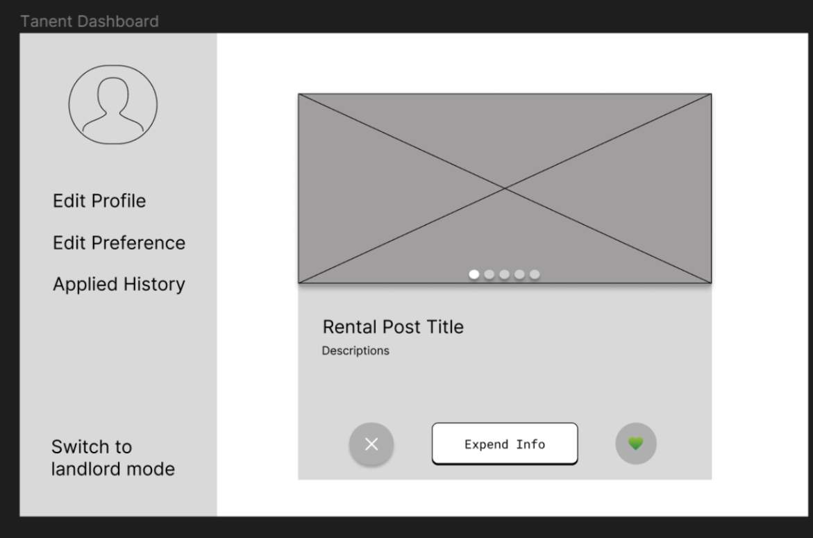
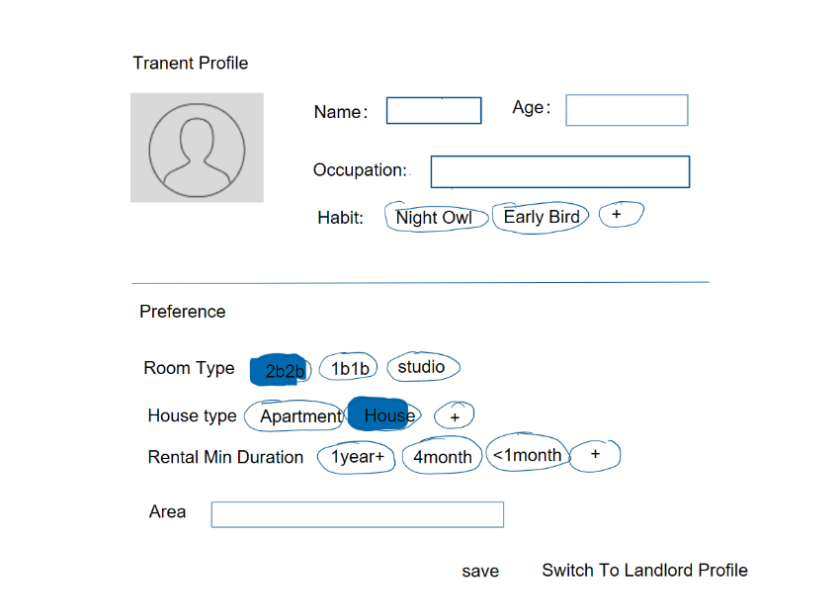
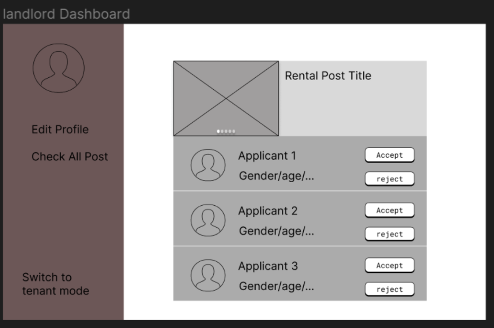

# Group 15 - Deja

## Project Description
Our project, DejaDwell, is a platform designed for tenants and landlords to facilitate finding rental accommodations. It allows tenants to post their profile data and preferences while enabling landlords to post details of their units. Tenants are matched with homes that fit their preferences, while landlords connect with tenants who meet their criteria. With DejaDwell, we offer a streamlined and effective process for finding your perfect rental or tenant.
 
Deployed Link: https://deja-dwell.onrender.com/login 
Mock credentials:
- Tenant Account: 
    Username: MockTenant@demo.com
    Password: MockTenant123
- Landlord Account:
    Username: landlord2@example.com
    Password: password2

## Project Requirements
### Minimal Requirements
1. ✅ Create/modify a user profile (user information and housing preference)
    - Each user can have one of:
        - Landlord account
        - Tenant account
2. ✅ Matching
    - Match landlord properties to tenant preferences
3. ✅ Dashboard
    - Landlord: View the list of applicants and their info
        - Mini view -> name, e-mail, phone number
        - Expanded view -> other preference info
    - Tenant: Display matching property posts in card format
        - Mini view -> image, location, price, etc.
        - Expanded view -> other property info

### Standard Requirements
1. ✅ User Login page
    - Allows user to store data in their account
    - User can log in and log out
2. ✅ Application status
    - For Tenant account: Store history of applied post 
    - For the landlord: Store history of matched applicants (Tenants) along with their applied post
3. ✅ Two types of rent match:
   - tight match (Search -> use a search bar to filter properties)
   - loose match (Recommendation -> tenants are matched with properties by our system)
4. ✅ Make the matching algorithm more robust
    - Add weightings to scores where more important factors like price are weighted heavily
5. ✅ For landlord account: A Landlord dashboard page that shows the current list of applicants with accept/reject buttons for each applicant.
    - the landlord will reach out to the list of tenants matched by the system (externally, interview/in-person house tour), once the landlord and tenant sign the contract (externally), the landlord will press accept and other tenants on the list will be automatically rejected.
    - Landlord will only see contact info of tenant after they apply, tenant will only see landlord's contact info after they apply
    - Landlord can reopen their property in case of external disagreements

### Stretch Requirements
1. ✅ Actual swiping of each selection
    - Allow tenant to drag property cards to the left to dislike and the right to like
2. ✅ Map API integration to mark property location on the map
3. ❌ On-demand feedback; as the user looks through options we ask them why they did not choose this specific option
4. ❌ Profile reviews of the tenant/landlord profiles
5. ❌ Preference updating based on swap and feedback demand
6. ❌ Allow the landlord to list multiple properties
7. ❌ Once matched, enable the landlord and tenant to interact
    - Chat message
    - Contact exchange
    - Interview process
  
## Tech Usage
- **Unit 1 - HTML, CSS, JavaScript** - These fundamental technologies were essential for building our application's interface. HTML provided the structure, CSS was used for styling, and JavaScript enabled interactivity. React utilized these technologies to create dynamic and responsive UI components, ensuring a seamless and engaging user experience.
- **Unit 2 - React/Redux** - The user interface was developed with React, combining CSS, Material-UI components, and React libraries to achieve a clean design. Redux was integral in managing the application's state, particularly for handling property data. It facilitated smooth data flow and synchronization across various UI components by managing the state where filtered and cleaned property data from the backend was stored. This ensured that the latest and most relevant property information was always available to users in real-time.
- **Unit 3 - Node/Express** - Node.js powered our backend development, enabling efficient server-side operations and integration with external APIs. Express.js served as our web server framework, establishing endpoints for user authentication, profile management, and property listings, where the filtering and cleaning of data occurred before storing it in the state.
- **Unit 4 - Database via MongoDB** - MongoDB was our choice for data storage, managing user profiles, preferences, property details, and match results. Its flexible schema and quick access capabilities were crucial for adapting to the evolving requirements of our application.
- **Unit 5 - Release Engineering via Render** - Render was utilized for deploying our application, providing a robust platform for hosting backend services and serving the frontend via static files during the build step. The deployment process was streamlined with automatic updates from our GitHub repository through GitHub Actions and Render's deploy hooks, ensuring our application remained current and efficient.

## Above and Beyond Functionality
Our project goes above and beyond by incorporating two distinct search methods, allowing two ways for tenants to view properties, which improves the user experience. We have a Tinder-like recommendation page that suggests postings to users based on their preferences, determined by our custom algorithm which generates a "match score". This feature enables tenants to flawlessly drag and drop properties to like or dislike, implemented using advanced React libraries and handling UI interactions, which demonstrates a level of proficiency beyond course expectations. The second type of search is where tenants can view property postings in a list format. Users can enter keywords or apply filters to find properties that meet their criteria. This search functionality ensures users have flexible and efficient ways to discover properties that suit their needs.
To further improve the user experience, we integrated the Google Maps API to add sophisticated map functionalities. By default, the map centers on the user's location, providing a personalized starting point. The map supports several advanced features, including:
- Displaying markers for all property addresses.
- Clustering markers when zooming out to avoid clutter.
- Displaying property prices when hovering over markers enhances the browsing experience.
- Providing real-time updates: liking or disliking a property removes its marker from the map, clicking on a property posting centers and zooms into that specific location on the map, and clicking on a marker opens the corresponding posting.

All these user interactions are robust and bug-free, showcasing a seamless user experience. Implementing these map features demonstrated advanced usage of React and external API integration, as it was entirely done on the frontend using multiple React hooks.

## Next Steps
To further improve the app, we would focus on enhancing the matching functionality, as it is the core feature of our platform:
- Implement on-demand feedback to understand why users did not choose specific options.
- Add profile reviews for tenant and landlord profiles to build trust and transparency within the platform.
- Enhance our preference updating system based on user interactions and feedback, ensuring our matching algorithm continuously evolves to provide the best possible matches.

## Contributors
### Derek 
TBD

### Emily
- Developed and refactored a large portion of React components using plain React, React libraries, and CSS to enhance UI/UX features
- Implemented and optimized external API integration, including the Google Maps API, geocoding API, and distance matrix API
- Performed a lot of manual testings to identify and resolve bugs in the frontend and API endpoints

### Jackson
- Took over the majority of the frontend styling, fixed UI bugs, and enhanced UI features and functionality.
- Developed the backend logic and integrated it with the database.
- Established release engineering using Render and GitHub Actions to implement CI/CD.

### Xinyue 
- Implement main React & Redux componemnts, including user and property input forms with validations, React Routers
- Prepared mock data, set up MongoDB schemas and import script 
- Developed server routes and NoSQL queries for user signIn/register, user and property information management.  
- Enhanced UI/UX styling, added responsiveness for change screen sizes.

## Prototype Sketches
#### Tenant Dashboard

#### Tenant Profile

#### Landlord Dashboard

## References
- Partial concept design is modified from Xinyue's CPSC344 prototype design project: https://www.youtube.com/watch?v=7eFO5YDZCoo 

